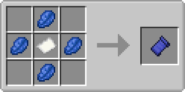

# Bits And Chisels

[https://github.com/CoolMineman/BitsAndChisels](https://github.com/CoolMineman/BitsAndChisels)

Bits and Chisels is a Fabric mod for modern Minecraft that lets you remove small bits from blocks using chisels. You can use these bits to build detailed decorations or whatever else you want. Requires Fabric API. Has Canvas Renderer support for shaders. Uses greedy meshing and the Fabric Renderer API to achieve high FPS post-1.13 rendering changes. This mod was inspired by Chisel and Bits.

## Setup

For setup instructions please see the [fabric wiki page](https://fabricmc.net/wiki/tutorial:setup) that relates to the IDE that you are using.

## How to Use

### Bits

Bits are pixel sized portions of blocks. You can place bits by right-clicking with them, or you can right-click while sneaking in order to select an area to fill with bits. There are a total of 4096 bits per block. There are no limits to a stack of bits within the inventory.

### Iron Chisle

The Iron Chisle carves out 64-bit (4 x 4 x 4) areas within blocks by left-clicking with it. This tool is useful for gathering large amounts of bits to bulid with.

### Diamond Chisle

The Diamond Chisle can carve out small 1-bit (1 x 1 x 1) areas within blocks by left-clicking with it. This is useful for creating very small details in blocks.

### Smart Chisle

The Smart Chisle can carve out an area of a block by left-clicking on two different bits within a block.

### The Wrench

The Wrench tool allows you to rotate your Bit Collection Block 90-degrees by right clicking on it. You can change which axis the collection rotates depending on which side of the block you click on. 

### The Blueprint

The Blueprint allows you to create a copy of your Bit Collection Block by right-clicking with an unwritten blueprint. This can then be pasted into the world by right-clicking with a written blueprint. The blueprint consumes bits from your inventory to copy the collection into the world. If you do not have enough bits in your inventory to completely fill the blueprint, then only part of the copy will be pasted.

## License

This mod is available under the CC0 license. Feel free to learn from it and incorporate it in your own projects.
